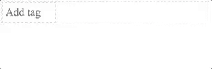

# [react-input-tags](https://www.npmjs.com/package/react-input-tags) | [demo](https://baldwmic.github.io/react-input-tags/)
React component for tagging inputs.



[](https://badge.fury.io/js/react-input-tags)

[](https://travis-ci.org/baldwmic/react-input-tags)

## Getting Started
### Install Package
```
npm install --save react-input-tags
```

### [Use Package](src/example/TagsExample.jsx)
```
import React from 'react';
import { InputTagsContainer } from 'react-input-tags';

export class TagsExample extends React.Component {
  state = {
    tags: [],
  }

  handleUpdateTags = (tags) => {
    this.setState({ tags });
  }

  render() {
    return (
      <InputTagsContainer
        tags={this.state.tags}
        handleUpdateTags={this.handleUpdateTags}
      />
    );
  }
}
```

## API
Both the high-level `InputTagsContainer` component or the low-level `InputTags` component are exported for use.

### [InputTagsContainer](src/interface/InputTagsContainer.jsx)
|Property|Type|Required|Description|
|--------|----|:-----:|-----------|
|`tags`|Array|✓|An array of data that represents the value of the tags|
|`handleUpdateTags`|Function|✓|A function called when the value of tags changes, passes the tags value as an argument.|
|`getTagValue`|Function||A function called when a tag is edited, passes the tag as an argument.|
|`createTag`|Function||A function called when a tag is to be inserted, passes the input value as an argument.|
|`inputPlaceholder`|String||The placeholder to populate the input with|
|`inputTabIndex`|Number||The tab index for the input|
|`inputMaxWidth`|Number||The max width the input can take up in pixels|
|`suggestions`|Array||An array of data that represents the value of the suggestions|
|`handleUpdateSuggestions`|Function||A function called when the value of input changes, passes the input value as an argument.|
|`getSuggestionValue`|Function||A function called when a suggestion is selected, passes the suggestion value as an argument.|
|`suggestionsAreLoading`|Boolean||Whether the suggestions are loading or not.|
|`InputTagsContainerImplementation`|Function||A function called when InputTagsContainer component is to be rendered.|
|`InputTagsImplementation`|Function||A function called when InputTags component is to be rendered.|
|`InputImplementation`|Function||A function called when Input component is to be rendered.|
|`TagImplementation`|Function||A function called when Tag component is to be rendered.|
|`SuggestionListImplementation`|Function||A function called when SuggestionList component is to be rendered.|
|`SuggestionImplementation`|Function||A function called when Suggestion component is to be rendered.|
|`SuggestionsLoaderImplementation`|Function||A function called when SuggestionsLoader component is to be rendered.|
|`InputTagsClassName`|String||A class for the InputTags component.|
|`InputClassName`|String||A class for the Input component.|
|`TagClassName`|String||A class for the Tag component.|
|`SuggestionListClassName`|String||A class for the SuggestionList component.|
|`SuggestionClassName`|String||A class for the Suggestion component.|
|`SuggestionsLoaderClassName`|String||A class for the SuggestionsLoader component.|

### [InputTags](src/interface/InputTags.jsx)
|Property|Type|Required|Description|
|--------|----|:-----:|-----------|
|`tags`|Array|✓|An array of data that represents the value of the tags|
|`handleInsert`|Function|✓|A function called when a tag will be inserted, passes the current tags value and new tag value as arguments.|
|`handleRemove`|Function|✓|A function called when a tag will be removed, passes the current tags value and index of the tag to be removed as arguments.|
|`getTagValue`|Function||A function called when a tag is edited, passes the tag as an argument.|
|`createTag`|Function||A function called when a tag is to be inserted, passes the input value as an argument.|
|`inputPlaceholder`|String||The placeholder to populate the input with|
|`inputTabIndex`|Number||The tab index for the input|
|`inputMaxWidth`|Number||The max width the input can take up in pixels|
|`suggestions`|Array||An array of data that represents the value of the suggestions|
|`handleUpdateSuggestions`|Function||A function called when the value of input changes, passes the input value as an argument.|
|`getSuggestionValue`|Function||A function called when a suggestion is selected, passes the suggestion value as an argument.|
|`suggestionsAreLoading`|Boolean||Whether the suggestions are loading or not.|
|`InputTagsImplementation`|Function||A function called when InputTags component is to be rendered.|
|`InputImplementation`|Function||A function called when Input component is to be rendered.|
|`TagImplementation`|Function||A function called when Tag component is to be rendered.|
|`SuggestionListImplementation`|Function||A function called when SuggestionList component is to be rendered.|
|`SuggestionImplementation`|Function||A function called when Suggestion component is to be rendered.|
|`SuggestionsLoaderImplementation`|Function||A function called when SuggestionsLoader component is to be rendered.|
|`InputTagsClassName`|String||A class for the InputTags component.|
|`InputClassName`|String||A class for the Input component.|
|`TagClassName`|String||A class for the Tag component.|
|`SuggestionListClassName`|String||A class for the SuggestionList component.|
|`SuggestionClassName`|String||A class for the Suggestion component.|
|`SuggestionsLoaderClassName`|String||A class for the SuggestionsLoader component.|
